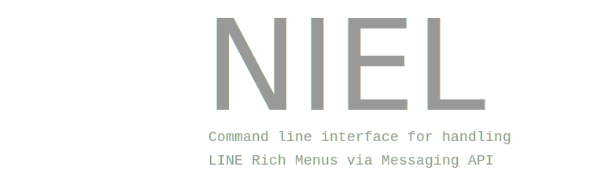

# NIEL

[](https://github.com/aekasitt/niel/static/niel-banner.svg)

```bash
$ pip install niel
> ...
$ niel
> Usage: niel [OPTIONS] COMMAND [ARGS]...
>
>   niel
>
> Options:
>   --version  Show the version and exit.
>   --help     Show this message and exit.
>
> Commands:
>   auth         Start an authenticated session
>   create       Create a new rich menu
>   default      Show default rich menu identifier
>   drop         Drop rich menu identified by `menu_id`
>   image        Upload an image found by given `image-path` for the...
>   set-default  Set default rich menu identified by `menu_id
```

Authenticate session (janky)

```bash
$ niel auth `<line-channel-access-token>`
> # Rewrites `.zshrc` or `.bashrc` with NIEL_AUTH_SESSION appended
$ source ~/.zshrc
> # OR
$ source ~/.bashrc
```

The next shell environment you open, will now have $NIEL_AUTH_SESSION
defined as your inserted line-channel-access-token.

Next step, create a RichMenu with defined YAML-file

```bash
$ niel create example.yml
> richmenu-fd5610793084b22a00a8eeb3812d5dd8
```

Upload an image for your preferred RichMenu

```bash
$ niel image default.png richmenu-fd5610793084b22a00a8eeb3812d5dd8
> True
```

Set desired RichMenu with image uploaded as the default RichMenu

```bash
$ niel set-default richmenu-fd5610793084b22a00a8eeb3812d5dd8
> True
```

Drop undesired RichMenu

```bash
$ niel drop richmenu-fd5610793084b22a00a8eeb3812d5dd8
> True
```

Unable to repeatedly drop the same RichMenu identified by menu-id

```bash
$ niel drop richmenu-fd5610793084b22a00a8eeb3812d5dd8
> False
```

Now you can create 
## Contributions

Unless LINE Messaging API changes, no planned changes on the project.
But if you want to try your hand at the project, here is the recommended
set-up for your local development environmnet.

```bash
$ pip install poetry
> ...
$ poetry install --with dev  # Install with development dependencies
> ...
```

This project has two development dependencies as such:

* mypy - Python type-safety (lol?)
* ruff - Python linter and formatter

## License

This project is licensed under the terms of the MIT license.

